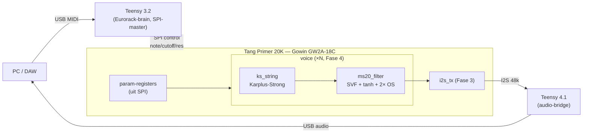
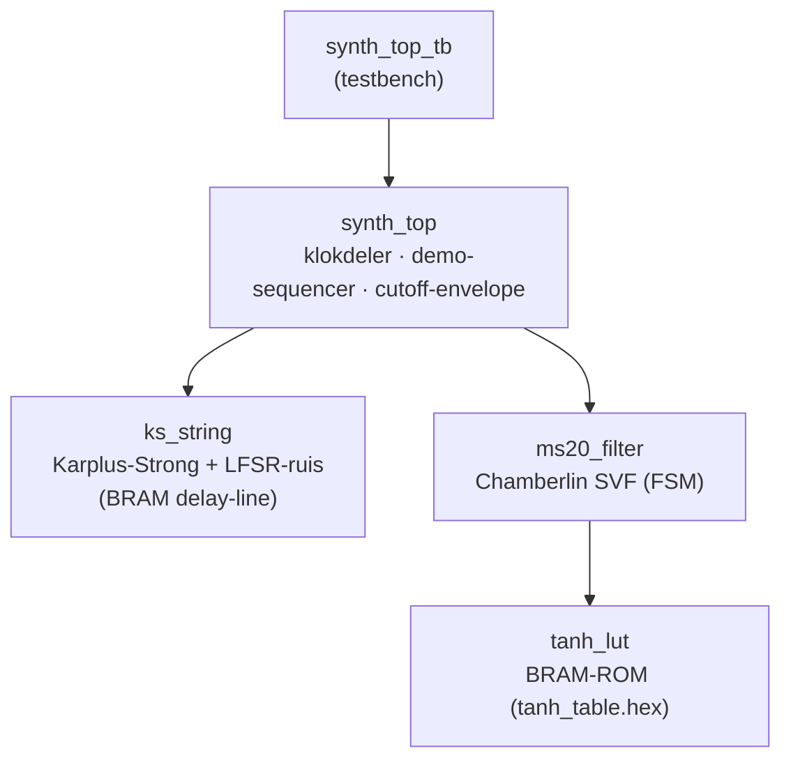
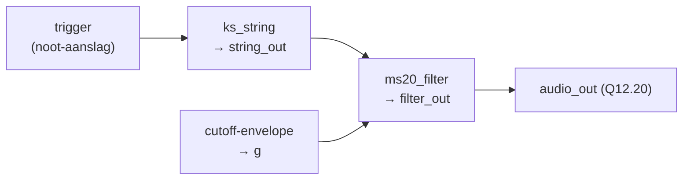
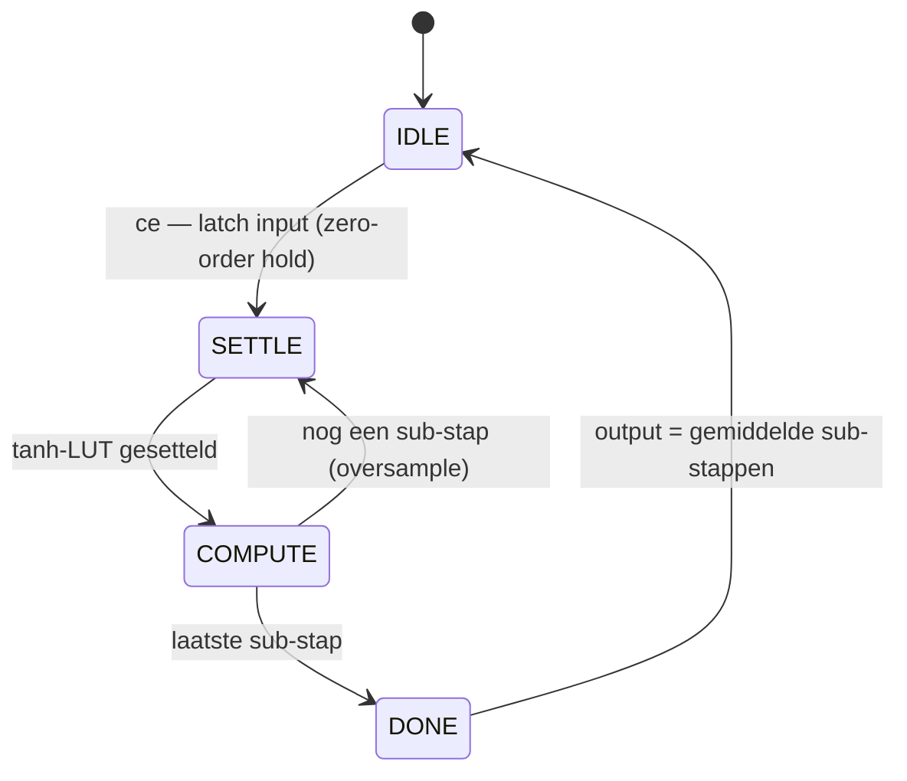

# Architectuur

Visueel overzicht van het MS-20 synth-voice project. De diagrammen zijn
[Mermaid](https://mermaid.js.org/) — ze renderen automatisch op GitHub en in
VSCode (extensie *Markdown Preview Mermaid Support*).

> Verilog automatisch visualiseren? Zie [§ Verilog visualiseren](#verilog-visualiseren) onderaan.

## Systeem (doel-opstelling)



In de **huidige** (sim-)staat staat in plaats van SPI een interne demo-sequencer
en is er nog geen I2S/Teensy — de audio komt via de testbench naar WAV.

## Module-hiërarchie (huidig)



## Signaalketen per audio-sample (48 kHz)



## Filter-FSM (`ms20_filter`)

De filter draait intern op 2× oversampling. Omdat de tanh-LUT een geklokte
BRAM-read is, sequencet een kleine toestandsmachine het rekenen:



Per sub-stap (Chamberlin SVF met niet-lineaire feedback):

```
hp = in − lp − k · tanh(drive · bp)      ← k = demping (LAGER = meer resonantie)
bp = bp + g · hp                         ← g = 2·sin(π·fc / 96000)
lp = lp + g · bp
```

## Fixed-point conventie

Alles is **Q12.20** (signed 32-bit, 1.0 = `0x00100000`). Vermenigvuldigen geeft
Q24.40 in 64-bit; terugschalen met `>>> 20`.

## Verilog visualiseren

Naast de handgemaakte Mermaid-diagrammen hierboven kun je Verilog ook
*automatisch* tot schema's omzetten:

| Tool | Wat je krijgt |
|---|---|
| **Gowin EDA → Schematic/Netlist Viewer** | RTL- en post-synthese gate-schema van je echte design (na synthese). Tools-menu in de IDE. |
| **Yosys** `show` (+ Graphviz) | RTL-graaf per module: `yosys -p "read_verilog src/ms20_filter.v; proc; show"`. |
| **netlistsvg** | Mooiere SVG-schema's uit een Yosys JSON-netlist. |
| **WaveDrom** | Timing-/golfvormdiagrammen (handig voor SPI/I2S-protocollen). |
| **GTKWave / DSim waveform** | De daadwerkelijke signalen over tijd (uit een VCD; zet `+define+DUMP_VCD` aan). |

Voor *structuur & samenhang* zijn Mermaid + de Gowin Netlist Viewer het handigst;
voor *dynamiek* de FSM-diagrammen + een waveform-viewer.
